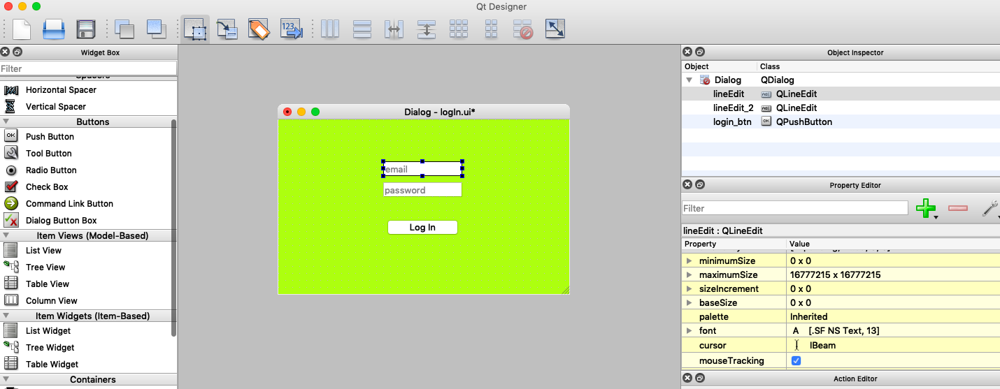

# Unit3-HasanMajdi
Unit 3 Project for Computer Science. 

OEd Items Inventory 
==========================
An applictaion to track and identify the items exsists or lent in the OUT DOOR EDUCATION Program (OEd) in UWC ISAK Japan. 


Contents
---------
  1. [Planning](#planning)
  2. [SolutionOverview](#SolutionOverview)
  3. [Development](#development)
  4. [Evaluation](#evaluation)
  5. [References](#References)
  
  Planning
----------
### Definition of the problem 
The client is the OUT DOOR EDUCATION program in UWC ISAK Japan, they have a list of equipment for hikes and out door trips, such as tents, rucksacks, sleeping bags, and sleeping mats. these items can be lend to hikers for OEd organized trips, but most of the time the OEd team can lost the items beause of the lack of a system that allows them to know to who the equipments were lent to. Therefore, the client is asking to develop a desktop application that allows the team to control their equipments in a more manageable way, that make finding the items easy and simple, and tracking what the items are and to whom they were lent to, provided with an email of the indivisual who has them, so they won't have to buy new equipments everytime they lose, and decrease their monthly budget, and be more Sustainable. 
**fig.1** 

***An email from the client (OEd Team), cleary what they want in the inventory from features.***

### Solution proposed
The solution is to create an application where the client can have all the requirments done, the developer decided to use Python programming language as a tool to develop this application as it is an avaliable language that is free to use and has a lot of resources to learn from, also because the developler is learning it now and can get support at anytime, **python;** is an interpreted, high-level, general-purpose programming language. Created by Guido van Rossum and first released in 1991. 
for designing the application, we will be working on Qt Desinger combined with Python **(Pyqt5)** as it is an easy and avaliable tool to design and well documented. The application will be a tool to make what the client requires happen, the program would allow the users to have a security system where all their data is secured and only accessible by specific members of the team, it will store make the process of tracking equipments easier for the OEd team and to know to whom the equipments were lent for. 


### Feasibility Study 

**TELOS** is an acronym in project management used to define five areas of feasibility that determine whether
a project should run or not. 

**T - Technical** - Is the project technically possible?

Yes, the project is possible in the tecnical part and the developers are able to create such a thing.
__________________________________________________________________________________________________________________________
**E - Economic -** Can the project be afforded? Will it increase profit?

The project is affordable for the developers and does not require a budget.
__________________________________________________________________________________________________________________________
**L - Legal -** Is the project legal?

The project is legal, and does not have any conflicts with laws/rules. 
__________________________________________________________________________________________________________________________
**O - Operational -** How will the current operations support the change?

The operations are welling to support the project and they asked for us to develop it. 
__________________________________________________________________________________________________________________________
**S - Scheduling -** Can the project be done in time?

Yes, the developer is able to handle the project on the time required. 
__________________________________________________________________________________________________________________________

### Success criteria 
1. System can track the equipments lent. 
2. system is secured and only accessible by specific members. 
3. items can be removed or added. 
4. items are categorised.
5. system has a search method to make it easier to find items. 
6. Be able to determine whether the equipments in the storage or lent out. 
7. Be able to identify who is the person that the equipment lent to and provide an email. 
8. Client should be satisfied about the application and have their requirments done.

Development 
------------

### Design; paper-prototype : 

One of the simplest ways to start designing an application/website is to paper prototype. which means sketching it on a paper and try to combine ideas and put them down, one of its features is that it is easy to edit, so if the client changes their mind about the elements, you can easily edit it. it helps having an idea about the work before you acctually step over and design it.

**Fig.1**


**Fig.1** is showing the first design for the OEd inventory, it is showing the Login secure page. 


**Fig.2**


**Fig.2** is showing the mainpage for the inventory, here is where the user woill get the news about the inventory and about the items lent. 


### Design; Qt Designiner : 

**Qt Designer and GUI Applications "Pyqt5"**


*What is Qt designer?*

Qt Designer is the Qt tool for designing and building graphical user interfaces (GUIs) with Qt Widgets. it can compose and customize windows or dialogs in a what-you-see-is-what-you-get (WYSIWYG) manner, and test them using different styles and resolutions. 

**After creating the paper-prototype, the meeting and going through it with the clients, we now have to make the paper prototype and actual application (User Interface), and will be developing with Qt designer and Python.**

**Fig.3** 

**Fig.3**: designing Login user interface on Qt Designer

**Fig.4** 

**Fig.4**: The Main page design on Qt Designer 

### Converting the UI file to python file: 
After saving the file in the desktop, we drag it to the Pycharm's project folder. 
Now, we convert the UI file to a python file so we can start creating classes and inherit from the file. 
To convert we use this command: 
```.py 
pyuic5 NameOfFile.ui -o NameOfFile.py
```
### Creating a python code that inherits from the Ui file that converted to python: 
**Inheriting** is a good method to use a specififc class in the Ui file that was converted to python. it allows a class to have the same behavior as another class and extend that behavior to provide special action for specific needs.
```.py 
import sys
from PyQt5.QtCore import pyqtSlot
from PyQt5.QtWidgets import QApplication, QDialog, QMainWindow # importing liberies 
from FileName import Class_Name # inheriting a class from the converted file
from logIn import Ui_Dialog # an Ex. inheriting a class from the file 

# Creating a class Initializer that inherits from the UI we created in QtDesigner after converting it. 

class Main(QMainWindow, Ui_MainWindow):
    def __init__(self, parent=None):
        super(Main, self).__init__(parent) # super is the main class
        self.setupUi(self) ## the parent classes are the UI MainWindow which created in QtDesigner, and the general class QMainWindow from PyQT
``` 
## Code to start the app:

```.py
app = QApplication(sys.argv) # Creates an application. 
widget = Loginpage() # Creates an object of the class. 
widget.show() # shows the Ui 
sys.exit(app.exec_()) # Exit the app

```
## Login Window: 

The login window is the first window of the application where the user entres their name and password. as long as the client requires that specific members only can access the inventory who are the OEd team, we do not need a registeration window. 
this help us to success the criteria 7 "System is secure and accessed only by specific members". 

 ```.py 
 
 user = "Lydia" 
password = "Lydia"
welcome = "Hello User"


class Loginpage(Ui_Dialog):
    def __init__(self, parent=None):
        super(Loginpage, self).__init__(parent)
        self.setupUi(self)

        self.login_btn.clicked.connect(self.retrieveText) ## when the Login button is clickced, the code goes to this function which is retrieveText

    def retrieveText(self):
        print("Button was cliked")
        # checks the password and email
        email = self.lineEdit.text()
        print('email entered=', email)
        if email == "": ## if the email is empty, the borders color turns to red.
            self.lineEdit.setStyleSheet("#lineEdit{\n"
                                        "border: 2px solid;\n"
                                        "border-color: red;\n"
                                        "}")
        else:
            self.lineEdit.setStyleSheet("#lineEdit{\n"
                                        "border: 3px solid;\n"
                                        "border-color: green;\n"
                                        "}")
        # if the email is empty raise a warning
        entered_pass = self.lineEdit_2.text()
        if password == entered_pass:
            print("Login corerct")
            self.done(0)


        else:
            self.lineEdit.setStyleSheet("#lineEdit{\n"
                                        "border: 3px solid;\n"
                                        "border-color: red;\n"
                                        "}")
            print("Wrong password")
            
```

**Fig.5** 

**Fig.5**: is showing the window at the beggining without entering anything. 

**Fig.6** 

**Fig.6**: is showing when the user enters a wrong User name and password, as shwoing in the code, it will turn red and will print a message saying that it is a wrong password. 

### Main Window 
This is window design where the client will be seeing the news for the inventory, what is being lent out and to whom, the date, email of the lender, and all information to keep tracking of the items. 

**Fig. 7** 

As we can see in **Fig. 7** is showing the main window with the information about the items and the date the action happened. 

### Data Base 
In the main window, we have the table where information will be showing for the inventory, and inorder to show the data, a Data Base should be created, the Data base is going to be a CSV file (Comma-separated values).           
**Why CSV?** 
1. CSV is a simple file format used to store data, such as a spreadsheet or in our case a Database. They mostly use the comma character to delimit data, it is also possible to open CSV files in spreadsheet programs (Like numbers in Mac), which make them easier to read.
2. CSV files are readable and easy to edit manually.
3. CSV files are simple to implement and parse.
4. CSV files are processed by a lot of applications including Qt Designer which is the application used to develop this project.
5. CSV files are small in size.

### Password and Secure Log in System 

As One of the requirements for the Application (Criteria 2 "system is secured and only accessible by specific members.") We are going to create system that allows only specific members to have access to the inventory, (People who are members of the OEd Team). and for that, I have created to two methods with different levels of security. 

**Method_1** 
Having the Password and User name stored in variables the code it self: 
```.py
user = "Lydia" 
password = "12345678"

```
Then having a Checking function that would check wheather the username and the password enterd by the user is the same as the ones stored in the variables or not, if not, the borders of both the USERNAME and the PASSWORD would change to red to show that the information entered was not correct. 

```.py 

def retrieveText(self):
        print("Button was cliked")
        # checks the password and email
        email = self.lineEdit.text()
        print('email entered=', email)
        if email == "": ## if the email is empty, the borders color turns to red.
            self.lineEdit.setStyleSheet("#lineEdit{\n"
                                        "border: 2px solid;\n"
                                        "border-color: red;\n"
                                        "}")
        else:
            self.lineEdit.setStyleSheet("#lineEdit{\n"
                                        "border: 3px solid;\n"
                                        "border-color: green;\n"
                                        "}")
        # if the email is empty raise a warning
        entered_pass = self.lineEdit_2.text()
        if password == entered_pass:
            print("Login corerct")
            self.done(0)


        else:
            self.lineEdit.setStyleSheet("#lineEdit{\n"
                                        "border: 3px solid;\n"
                                        "border-color: red;\n"
                                        "}")
            print("Wrong password")
```

This method is working and we can login and see the inventory, also, it might work for such a project since the using of the app is going to be limited for around 7 to 10 people. the problem with the method is the security, it is not secure, and any one who opens the code can see the password and the username easily, and for that reason, we are using **Method_2** as it gives a better solution for the application that can make the security improved, more advenced, and can help success Criteria 2. to the addition of that, it is going to be a great way of developing Computational thinking and have an experiance in how to maka a secure system that would also help in the process of creating the IA for IBDP.  

**Method_2** 
Here we will be using a Hash to provide more security to the Login System, **A Hash** is Just like a fingerprint for data, it is a sequance of numbers and signs, that help us in this case to make the code more secure. 
 - The same data has the same Hash it never changes. 
 - The amount of data does not matter, we're always gonna get the same amount of characters. 
 
```.py 
import hashlib, binascii, os #here we are importing hash library and binascii


def hash_password(password):
    salt = hashlib.sha256(os.urandom(60)).hexdigest().encode('ascii') ## A hash with a size of 64 bytes, encode('ascii')
    Converts the 64 bytes into 64 ascii text characters

    pwdhash = hashlib.pbkdf2_hmac('sha512', password.encode('utf-8'),
                                  salt, 100000) #Repeating the process to increase randomness.
    pwdhash = binascii.hexlify(pwdhash) #Converts to a Hexadecimal string

    return (salt + pwdhash).decode('ascii') #Returns a string with the salt first and then the hashed password
```
This is the first function of the code ``` hash_password ```  and what it does is encode a provided password in a way that is safe to store on a database or file, it generates random salt that should be added to the password. 

```.py 

def verify_password(stored_password, passEntered):
    salt = stored_password[:64] ##Recover the salt as the first 64 characters of the hash, because the first 64 are the
    password
    stored_password = stored_password[64:]
    pwdhash = hashlib.pbkdf2_hmac('sha512',
                                  passEntered.encode('utf-8'),
                                  salt.encode('ascii'),
                                  100000) #creating a hash with the recovered salt for the password given
    pwdhash = binascii.hexlify(pwdhash).decode('ascii')
    print(pwdhash)
    return pwdhash == stored_password ##Boolean: if the stored password and the given password are the same,
    then the hashes will be the same, and the return value is True
    
 ```
Here is the second function of the code ``` verify_password ```  Given an encoded password and a plain text one is provided by the user, it verifies whether the provided password matches the encoded one or not. 

# In the code: 
In the main file of the application ``` MAIN.py ``` i have imported these two functions``` hash_password ```and``` verify_password ```from a file in the project Unit-3 called ```myLib.py``` which has the code above for hashing the Password and the Username. 
```.py 
from myLib import verify_password, hash_password
```
Then we use this variable to move to the LoginPage class and show it.
```.py 
log = Loginpage(self)
        log.show()
```
The class **Loginpage** is connected to the function ``` try_login ``` when pressing the ```login_btn```, we use self. with ```try_login``` function because it belongs to the class **Loginpage**. 
```
class Loginpage(Ui_login):
    def __init__(self, parent=None):
        super(Loginpage, self).__init__(parent)
        self.setupUi(self)
        self.login_btn.clicked.connect(self.try_login)
```
**try_login function:** for this part of the development, we got the Pseudocode for the function from Dr.Ruben and we were asked to code it ourselves. 
 
**Fig. 8**  

*Fig. 8:* is showing the **Pseudocode** which is basiclly the steps or simply a way of describing a set of instructions that does not have to use specific syntax or langugae. 

**FULL CODE** 

Here is the full code for the ```try_login``` Function and the Pseudcode applied (Hashing the password)

```.py 
    def try_login(self):
        # Read the entred username
        user = self.Username.text()
        print('username entered=', user)
        # Read the entred password
        password = self.Password.text()
        print('Password', password)
        PassUSe = (user + password)
        # Open the file with the passwords
        with open('Output.csv') as Output_file:
            # Read in the file
            file = csv.reader(Output_file)
            for f in file:
                hsh = f
            print(hsh)
            # use the vertify_password function with the stored and given password
            Hash = verify_password(hash_password(hsh[0]), PassUSe)
            print(PassUSe)
            print(Hash)
            # if the password matches break the loop and close
            if Hash:
                self.close()
            # if not ; show an error , RED FRAME FOR BUTTONS
            else:
                self.Username.setStyleSheet("#Username{\n"
                                            "border: 3px solid;\n"
                                            "border-color: red;\n"
                                            "}")
                self.Password.setStyleSheet("#Password{\n"
                                            "border: 3px solid;\n"
                                            "border-color: red;\n"
                                            "}")
                print("Wrong password")
 ```
 
